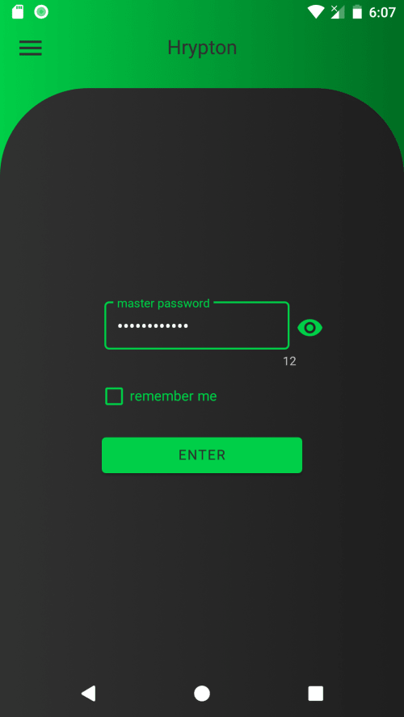
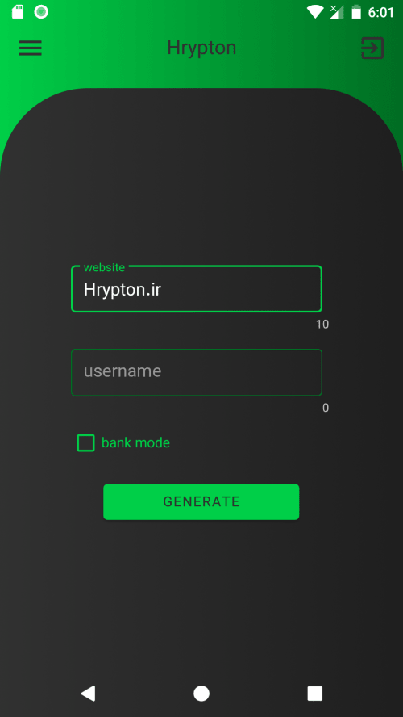
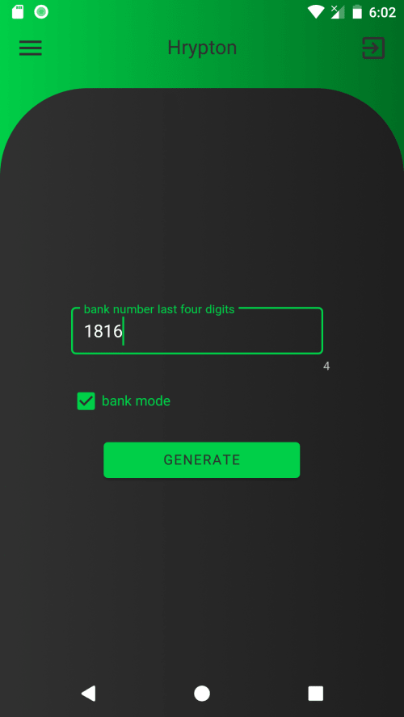

# Hrypton password manager
access to your passwords anywhere and anytime without saving anything

# main idea
what if you have a algorithm that can generate password with your inputs? so you don't need to save them because you can generate it later with same inputs
  
my algorithm is a hash based on sha256 and its so slow (so its very hard to crack even for super computers)
  
knowing that 
krypton is superman weakness  
Hrypton can be super computers weakness
  
and input parameters are: 

1. Master password
2. URL of website that you need passwoed for it
3. Your username

 
and this algorithm generates standard passwords that contains lowercase, uppercase, digits, and special charecters

# naming
<b>H</b>ash + K<b>rypton</b> -> <b>Hrypton</b>

# talk is cheap show me the code
ok checkout <a href="app/src/main/java/com/ali77gh/pash/core/Pasher.kt">this </a>.

# how it looks?

green like krypton

 
 

 

# who's behind this
idea and algorithm -> <a href="https://github.com/ali77gh">ali ghahremani</a>  
android ->  <a href="https://github.com/ali77gh">ali ghahremani</a>  
website - > <a href="https://github.com/Hoomanmsh">hooman mirshafie</a> 
web extentation -> <a href="https://github.com/Hoomanmsh">hooman mirshafie</a>

