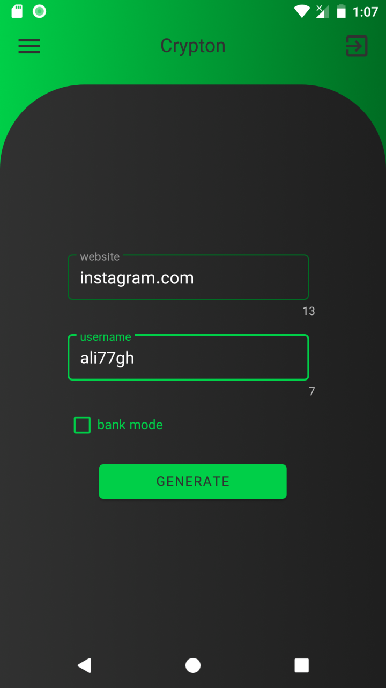

# Crypton password manager
save your password no where and access from everywhere.

# main idea
what if you have a algorithm that can generate password with your inputs? so you don't need to save them (because you can generate it later with same inputs)
  
my algorithm is a hash based on sha256 and its so slow (so its very hard to crack even for super computers)
  
so:
 
krypton is superman weakness  
crypton is super computers weakness
  
and input parameters are: 

1. Master password
2. URL of website that you need passwoed for it
3. Your username

# naming
it comes from krypton (super man weakness)(its green) and it mixed with crypto.

# talk is cheap show me the code
ok checkout <a href="app/src/main/java/com/ali77gh/pash/core/Pasher.kt">this </a> kotlin file.

# how it looks?

nice and green :)

# who's behind this
algorithm designer -> <a href="https://github.com/ali77gh"> ali</a>  
android ->  <a href="https://github.com/ali77gh"> ali</a>  
website - > <a href="https://github.com/Mehrdad-Farshi">mehrdad</a> 
web extentation -> <a href="https://github.com/Mehrdad-Farshi">mehrdad</a>